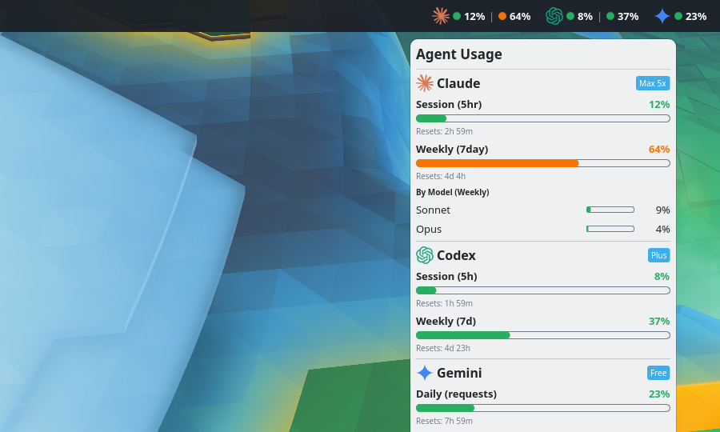
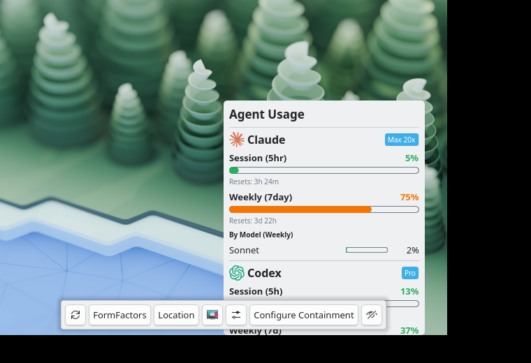

# Agent Usage — KDE Plasma 6 Widget

A KDE Plasma 6 panel widget that shows your **AI coding agent** usage side‑by‑side: **Claude Code**, **OpenAI Codex**, and **Google Gemini CLI** — session/weekly limits, reset countdowns, and per‑model breakdown.



*The compact readout sits in your panel bar; click it for the full popup — drop it on any Plasma 6 panel. (Screenshots use mock data.)*

<details><summary>Popup close-up</summary>



</details>

## Features

- **Three agents in one widget** — Claude, Codex, Gemini, each toggle‑able.
- **Compact panel** — text / circular ring / vertical bar styles; color‑coded (green `<50%`, yellow `<80%`, red `≥80%`). Agents you aren't logged into are hidden from the panel automatically.
- **Detailed popup** — per‑agent section: plan badge, each limit window as a progress bar + reset countdown, per‑model rows (Claude Sonnet/Opus).
- **Rate‑limit self‑healing** (Claude/Codex) — honors `retry-after`, exponential backoff, token‑refresh watch.
- **Local cache** (24h) + stale dimming, configurable refresh interval, multi‑language UI.

## Supported agents & data sources

| Agent | Source | Notes |
|---|---|---|
| **Claude** | `GET api.anthropic.com/api/oauth/usage` | Official, server‑computed %. Reads `~/.claude/.credentials.json`. |
| **Codex** | `GET chatgpt.com/backend-api/wham/usage` | Official, server‑computed %. **ChatGPT‑subscription mode only** (API‑key mode has no usage endpoint). Reads `~/.codex/auth.json`. |
| **Gemini** | Local request count (default) | **Estimate**: counts today's requests in `~/.gemini` logs ÷ daily tier cap. Requires **python3**. No network, ToS‑safe. |
| **Gemini** | `retrieveUserQuota` endpoint (opt‑in) | Exact server %, **off by default**. ⚠️ Google forbids third‑party tools reusing the CLI's OAuth — **account‑suspension risk**. Enable only if you accept that. |

## Requirements

- **KDE Plasma 6.0+**
- The agent CLI(s) you want to track, **installed and logged in** (`claude` / `codex` / `gemini`).
- **python3** — only for Gemini local request‑counting. Claude and Codex are pure QML, zero dependencies.

## Installation

```bash
git clone https://github.com/cygmris/plasma-agent-usage.git
cd plasma-agent-usage
./install.sh              # builds + installs/updates the widget
```

Or manually:

```bash
./build.sh               # produces plasma-agent-usage.plasmoid
kpackagetool6 -t Plasma/Applet -i plasma-agent-usage.plasmoid
```

Then right‑click your panel → **Add Widgets…** → search **Agent Usage**.

Uninstall: `kpackagetool6 -t Plasma/Applet -r org.kde.plasma.agentusage`

## Configuration

Right‑click the widget → **Configure…**:

- **Agents** — enable/disable Claude, Codex, Gemini independently.
- **Refresh interval** — default 5 min (lower values may trigger rate limiting).
- **Panel** — layout (horizontal/vertical), style (text/circular/bar), show icons.
- **Gemini endpoint (opt‑in)** — switches Gemini from local estimate to the official `retrieveUserQuota` endpoint. Carries an explicit account‑suspension warning; leave off unless you understand the risk.

## How it works

Each agent is a small **adapter** (`contents/ui/adapters/*.js`) that produces a normalized `UsageModel`; a generic `ProviderController.qml` runs the fetch (HTTP for Claude/Codex, a python3 helper for Gemini local counting) and the UI renders every enabled agent the same way. Adding an agent is just another adapter.

> **Plasmoid JS note:** the `.js` files use QML‑native modules (`.pragma library` / `.import`), **not** ES modules — required by the QML engine. Unit tests load them via a small shim (`tests/_qmljs.mjs`); run `node tests/*.mjs`.

## Credits & License

- Based on **[plasma-claude-usage](https://github.com/izll/plasma-claude-usage)** by **izll**.
- Built with **[Claude](https://claude.ai)** (Anthropic).
- Author: **Chris**
- License: **GPL‑3.0‑or‑later** (see [`LICENSE`](LICENSE)).
